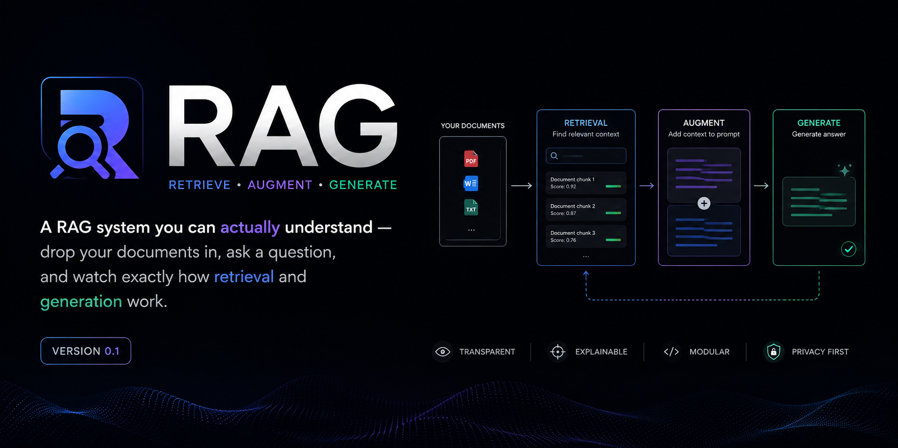

# RAG Prototype — See Retrieval-Augmented Generation Work, Not Just the Answer


A Retrieval-Augmented Generation system for company documents (PDF, DOCX), built with a console-style UI that shows *how* it arrived at an answer — the pipeline stages it ran, which sources it retrieved, how confident the match was, and the exact chunk vs. full-context text the LLM actually saw. Built as a learning-oriented reference implementation, not just a working demo.

> Drop your documents in, ask a question, and watch exactly how retrieval and generation work — end to end, visibly.

---

## Table of Contents

- [What this is](#what-this-is)
- [Features](#features)
- [Quickstart](#quickstart)
- [Architecture](#architecture)
- [Project structure](#project-structure)
- [Code walkthrough](#code-walkthrough)
- [Design decisions](#design-decisions)
- [Known limitations](#known-limitations)
- [Roadmap](#roadmap)

---

## What this is

Generic LLMs don't know your internal documents. RAG fixes that by retrieving relevant passages from your own document set and feeding them to the LLM as grounding context before it answers — instead of relying on the model's general (and possibly outdated, possibly wrong) knowledge.

This repo is a complete, working RAG pipeline plus a UI designed specifically to make the *mechanism* visible — most RAG demos just show a chat window with an answer; this one shows the pipeline stages executing, the retrieved sources with their similarity scores, and lets you inspect the exact chunk that matched versus the full context the LLM actually received. Built to be a genuinely useful reference for anyone learning how production RAG systems are structured, not just a black box that happens to work.

---

## Features

**Pipeline**
- Table-aware PDF/DOCX parsing (tables extracted as structured markdown, not flattened text)
- Structure-aware + recursive + parent/child chunking (small chunks for accurate search, full sections for LLM context)
- Department-tagged metadata filtering (foundation for role-based access control)
- Retry with exponential backoff on external API calls

**UI**
- Live pipeline trace — watch each stage (embed → search → resolve parents → generate) execute with real timing
- Answer streams in word-by-word, like watching it generate
- Relevance chart for every retrieved source, hand-built (no external charting dependency)
- Parent/child toggle per source — see the precise chunk that matched *and* the full context the LLM used
- Department/role scope selector — demonstrates access-controlled retrieval live
- Low-confidence warning state — shows the system declining to overreach instead of always looking successful
- Token usage per query
- Query history sidebar
- Collapsible raw JSON debug panel

---

## Quickstart

This takes a few minutes, not one — mainly because you need your own API keys first. Here's the real path:

**1. Clone and install:**
```bash
git clone <your-repo-url>
cd rag-prototype
pip install -r requirements.txt
```

**2. Get API keys** (both have free tiers):
- [Zhipu AI](https://open.bigmodel.cn) — for GLM-4.5 generation
- [Jina AI](https://jina.ai) — for embeddings

**3. Configure:**
```bash
cp .env.example .env
```
Fill in `ZHIPU_API_KEY` and `JINA_API_KEY` in `.env`.

**4. Add your documents**, organized by department (the folder name becomes the access-control tag):
```
data/sample_docs/
├── finance/
│   └── your_document.docx
└── it/
    └── your_document.pdf
```

**5. Ingest:**
```bash
python ingest.py
```

**6. Start the backend:**
```bash
uvicorn api:app --reload --port 8000
```

**7. Serve the UI:**
```bash
cd frontend
python -m http.server 5500
```
Open `http://localhost:5500` and ask a question.

*(If you skip steps 5–7, `index.html` still works standalone with mock data — useful for browsing the UI without setting anything up.)*

---

## Architecture

```
                     ┌─────────────────────┐
                     │   PDF / DOCX files    │
                     └──────────┬───────────┘
                                │
                    ┌───────────▼────────────┐
                    │   Document Loaders       │  loaders/
                    │  (table-aware extraction)│
                    └───────────┬────────────┘
                                │
                    ┌───────────▼────────────┐
                    │       Chunking            │  chunking.py
                    │  structure-aware split →  │
                    │  parent sections →         │
                    │  recursive split → children│
                    └──────┬─────────────┬──────┘
                           │             │
                 ┌─────────▼───┐   ┌─────▼──────────┐
                 │ Parent Store  │   │  Embeddings      │  embeddings.py
                 │ (full text)   │   │  (Jina API)       │
                 │ storage/      │   └─────┬──────────┘
                 └───────▲───────┘         │
                         │           ┌─────▼──────────┐
                         │           │  Vector Store     │  vectorstore.py
                         │           │  (Chroma, +dept   │
                         │           │   metadata filter)│
                         │           └─────┬──────────┘
                         │                 │
                    ┌────┴─────────────────▼────┐
                    │        RAG Pipeline           │  rag_pipeline.py
                    │  question → embed → search →  │
                    │  resolve parents → prompt →   │
                    │  LLM → answer + citations     │
                    │  (instrumented: timing per     │
                    │   stage, relevance scores)     │
                    └───────────────┬────────────┘
                                    │
                    ┌───────────────▼────────────┐
                    │   FastAPI backend (api.py)    │
                    │   POST /ask, GET /departments │
                    └───────────────┬────────────┘
                                    │
                    ┌───────────────▼────────────┐
                    │   Console UI (frontend/)      │
                    │  trace → streamed answer →    │
                    │  staggered sources + scores    │
                    └────────────────────────────┘
```

**Key design principle: small chunks for search, large chunks for context.** A short, precise chunk matches a specific question well in vector search, but an isolated sentence often lacks the context an LLM needs to answer well. This system embeds and searches small "child" chunks, then swaps each match for its full "parent" section before generation.

---

## Project structure

```
rag-prototype/
├── config.py                 # Centralized settings, loaded from .env
├── loaders/
│   ├── pdf_loader.py          # Table-aware PDF extraction (pdfplumber)
│   ├── docx_loader.py         # Table-aware DOCX extraction (python-docx)
│   └── document_loader.py     # Dispatches by file extension
├── chunking.py                # Structure-aware + recursive + parent/child chunking
├── embeddings.py              # Jina AI embedding client, with retry/backoff
├── vectorstore.py             # Chroma wrapper (storage + metadata-filtered search)
├── llm_client.py              # GLM-4.5 client (OpenAI-SDK-compatible)
├── rag_pipeline.py            # Core RAG loop, instrumented with timing + relevance scores
├── api.py                     # FastAPI layer: /ask, /departments, /health
├── ingest.py                  # CLI: walk data/sample_docs/<department>/, ingest all files
├── ask.py                     # CLI: interactive question-answering (no UI needed)
├── frontend/
│   └── index.html              # Console UI — single file, no build step
├── storage/
│   └── parent_store.py        # JSON-backed store for full parent sections
├── data/sample_docs/
│   ├── finance/                # Sample docs tagged "finance" department
│   └── it/                     # Sample docs tagged "it" department
├── requirements.txt
├── .env.example
└── .gitignore
```

---

## Code walkthrough

### `config.py` — centralized configuration
Every setting (API keys, model names, chunk sizes, top-k) loads from `.env` in exactly one place. Every other module imports `settings` from here, never `os.getenv` directly — changing a provider or tuning a parameter never means hunting through multiple files.

### `loaders/pdf_loader.py` and `loaders/docx_loader.py` — table-aware extraction
Naive text extraction flattens tables into a stream of words with no row/column structure — a table row can become indistinguishable from prose, which corrupts both chunking and the LLM's understanding of what numbers mean. These loaders detect table regions explicitly (`pdfplumber` for PDF, direct `python-docx` traversal for DOCX) and serialize them as markdown tables, kept separate from surrounding prose.

### `chunking.py` — structure-aware + recursive + parent/child splitting
Three techniques applied in sequence: a custom `StructureAwareTextSplitter` detects heading patterns and splits along topic boundaries; a `RecursiveCharacterTextSplitter` then enforces target chunk size within each section; markdown tables get split separately by row group, always repeating the header. Every child chunk carries `metadata["parent_id"]`, linking back to its full parent section.

### `embeddings.py` — Jina embedding client with retry
Wraps Jina's embeddings API with retry and exponential backoff (2s → 4s → 8s), since this external dependency has shown intermittent failures during development — including transient regional blocks. Uses `retrieval.passage` mode for documents and `retrieval.query` mode for questions, as required by the underlying model.

### `vectorstore.py` — Chroma wrapper
Stores child chunks with embeddings and metadata in a local persistent Chroma collection. Embeddings are computed externally and passed in explicitly, guaranteeing ingestion and query always use the identical model. `query()` accepts a `where` filter — the mechanism department-based access control uses.

### `rag_pipeline.py` — the instrumented core loop
Ties everything together and captures what the UI needs: per-stage timing, similarity-to-relevance score conversion, both the matched child chunk and its full parent, and a `low_confidence` flag when the best match falls below a relevance threshold. The system prompt explicitly instructs the model to answer only from provided context and say so when it can't.

### `api.py` — FastAPI layer
Thin wrapper exposing `/ask` (question + optional department filter), `/departments` (reads folder names from `data/sample_docs/`, keeping the UI's selector in sync with what's actually ingested), and `/health`. Deliberately minimal — no auth or rate limiting yet, consistent with prototype scope (see Limitations).

### `frontend/index.html` — the console UI
Single file, no build step, no external JS framework. Deliberately avoids charting libraries too — the relevance chart is hand-built with plain CSS, so the UI has no external dependency that can silently fail (an earlier version depended on a CDN-hosted charting library, which broke the whole render when the CDN was unreachable — worth knowing if you're extending this). The reveal sequence (trace → streamed answer → staggered sources) is deliberate: it mirrors the actual order these things happen in the pipeline, rather than dumping the full JSON response at once.

### `ingest.py` and `ask.py` — CLI entry points
`ingest.py` walks `data/sample_docs/<department>/`, so folder structure directly becomes the department metadata tag used for filtering. `ask.py` is a minimal terminal loop for testing without the UI running.

---

## Design decisions

| Decision | Reasoning |
|---|---|
| Parent-child chunking over flat chunking | Small chunks retrieve accurately; large chunks generate accurately. One chunk size for both is a compromise that hurts one or the other. |
| Table extraction as a separate path | Flattened table text broke both chunking (false heading matches) and answer accuracy (misread numbers) during development. |
| Metadata filtering at the vector-store level | Access control has to happen before results come back, not by asking the LLM nicely — that's a real security boundary, not a prompt instruction. |
| No external charting/JS framework in the UI | Fewer external dependencies means fewer ways for the demo to silently break on a restricted network — learned this the hard way mid-project. |
| Sequential UI reveal instead of one-shot render | Mirrors the actual pipeline order (retrieve, then generate, then here's the evidence) and makes each stage individually inspectable. |

---

## Known limitations

Deliberately out of scope for this stage, not oversights:

- **No OCR** — scanned/image-only PDF pages are skipped.
- **No speech-to-text** — voice source documents aren't yet supported.
- **No model fallback chain** — a single LLM provider (GLM-4.5), no automatic failover.
- **No auth/rate limiting on the API** — `api.py` is unauthenticated; add before any real deployment.
- **Not containerized** — runs as local Python + a static HTML file, no Docker packaging yet.
- **No automated tests.**
- **Sample/non-confidential data only** — using this with real confidential documents requires a decision from your legal/security team, since document content and questions currently go through third-party APIs (Zhipu, Jina).

## Roadmap

- [ ] Wire the department selector to actual authentication (currently a demo-only filter)
- [ ] OCR and speech-to-text ingestion
- [ ] Retrieval + answer quality evaluation set
- [ ] Model fallback chain, retry logic on generation calls
- [ ] Structured logging, metrics endpoint, request tracing
- [ ] Rate limiting, input validation hardening on `api.py`
- [ ] Dockerize + docker-compose
- [ ] Automated test suite
- [ ] Scale-out to a production vector DB (Qdrant/Milvus) for 100K–1M document corpora